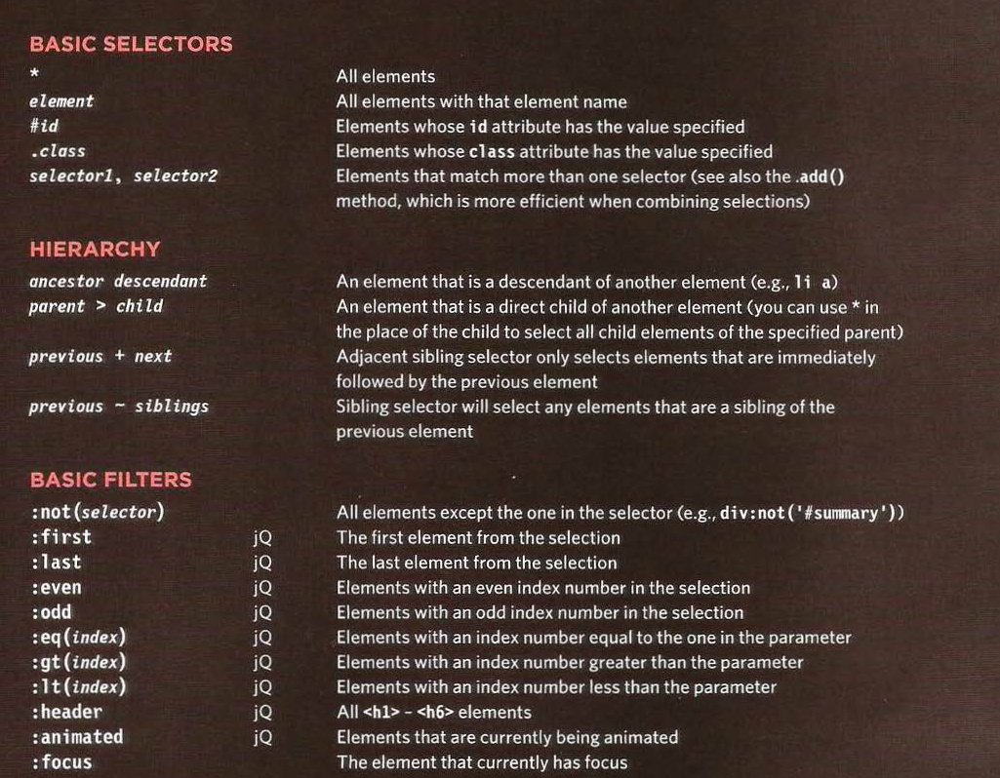

# jQuery, Events, and The DOM
**"Write less, do more,"**

__Readings__
- JavaScript and jQuery book by Jon Duckett **pages 293-301, 306-331 and 354-357**
- [6 Reasons for Pair Programming](https://www.codefellows.org/blog/6-reasons-for-pair-programming/)

__Skim__
- JavaScript and jQuery book by Jon Duckett **pages 332-335**

- JavaScript and jQuery book by Jon Duckett **pages 302-305**

### jQuery
**javascript file**
1. include the jQuery script in your page. it is included before the closing </body> tag.
1. $ () shortcut for the jQuery () function.
1. it makes coding simpler
    - SIMPLE SELECTORS
    - COMMON TASKS IN LESS CODE
        jQuery has methods that offer web developers simpler ways to perform common tasks, such as:
        • loop through elements
        • Add I remove elements from the DOM tree
        • Handle events
        • Fade elements into I out of view
        • Handle Ajax requests
1. chaining of methods __Once you have selected· some elements, this allows you to apply multiple methods to the same selection__
 

### 6 Reasons for Pair Programming
1. Greater efficiency
1. Engaged collaboration
1. Learning from fellow students
1. Social skills
1. Job interview readiness
1. Work environment readiness

- Iterative loops
- Code reviews
- Fast feedback

**The Driver** is the programmer who is typing and the only one whose hands are on the keyboard.
**Navigator** uses their words to guide the Driver but does not provide any direct input to the computer

__Why pair program__
 **four** fundamental skills that help anyone learn a new language: 
 1. Listening: hearing and interpreting the vocabulary 
 1. Speaking: using the correct words to communicate an idea 
 1. Reading: understanding what written language intends to convey 
 1. Writing: producing from scratch a meaningful
 **Pair programming touches on all four skills**