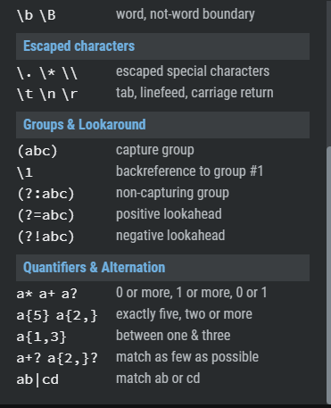

# Responsive Web Design and Regular Expressions

**Reading**
[CSS Grid Garden](https://cssgridgarden.com/)

**Bookmark/Skim**
[RegExr](https://regexr.com/) - Pay particular attention to the cheatsheet
[Regex Tutorial](https://medium.com/factory-mind/regex-tutorial-a-simple-cheatsheet-by-examples-649dc1c3f285)
[Regex 101](https://regex101.com/)
[CSS Grid Reference](https://css-tricks.com/snippets/css/complete-guide-grid/)
[Responsive design with CSS Grid](https://medium.com/samsung-internet-dev/common-responsive-layouts-with-css-grid-and-some-without-245a862f48df)

## A Complete Guide to Grid

**CSS Grid Layout is the most powerful layout system available in CSS. It is a 2-dimensional system, meaning it can handle both columns and rows, unlike flexbox which is largely a 1-dimensional system.**

**Properties for the Parent (Grid Container)**

- **display**
  - Values:
    grid - generates a block-level grid
    inline-grid - generates an inline-level grid
- **grid-template-columns/ grid-template-rows**
  - Values:
    <track-size> - can be a length, a percentage, or a fraction of the free space in the grid (using the fr unit)
    <line-name> - an arbitrary name of your choosing
- **grid-template-areas**
  - Values:
    <grid-area-name> - the name of a grid area specified with grid-area
    . - a period signifies an empty grid cell
    none - no grid areas are defined
- **grid-template** - Values:
  none - sets all three properties to their initial values
  <grid-template-rows> / <grid-template-columns> - sets grid-template-columns and grid-template-rows to the specified values, respectively, and sets grid-template-areas to none
  etc...

**Properties for the Children (Grid Items)**

- **grid-column-start/ grid-column-end/ grid-row-start/ grid-row-end**
  - Values:
    <line> - can be a number to refer to a numbered grid line, or a name to refer to a named grid line
    span <number> - the item will span across the provided number of grid tracks
    span <name> - the item will span across until it hits the next line with the provided name
    auto - indicates auto-placement, an automatic span, or a default span of one
- **grid-column/ grid-row** - Values:
  <start-line> / <end-line> - each one accepts all the same values as the longhand version, including span
  etc..

_grid-column-start property._
_grid-column-end property._
_If you want to count grid lines from the right instead of the left, you can give grid-column-start and grid-column-end negative values. For example, you can set it to **-1** to specify the **first grid line** from the **right**._

`#garden {
display: grid;
grid-template-columns: 20% 20% 20% 20% 20%;
grid-template-rows: 20% 20% 20% 20% 20%;
}

#water {
grid-column-start: 1;
grid-column-end:-2;
}`

**span** keyword, span only works with **positive** values.
`#water { grid-column-start: 2; grid-column-end:span 2; }`

_Typing both grid-column-start and grid-column-end every time can get tiring. Fortunately, grid-column is a shorthand property that can accept both values at once, separated by a slash._
**grid-column: 2 / 4;** **will set the grid item to start on the 2nd vertical grid line and end on the 4th grid line.**

_One of the things that sets CSS grids apart from flexbox is that you can easily position items in two dimensions: columns and rows. grid-row-start works much like grid-column-start except along the vertical axis._
**grid-row**
`#water { grid-row:3/6; }`

_If typing out both grid-column and grid-row is too much for you, there's yet another shorthand for that. **grid-area** accepts four values separated by slashes: **grid-row-start**, **grid-column-start**, **grid-row-end**, followed by **grid-column-end**._

One example of this would be **grid-area: 1 / 1 / 3 / 6;.**

_If grid items aren't explicitly placed with grid-area, grid-column, grid-row, etc., they are automatically placed according to their **order** in the source code. We can override this using the order property, which is one of the advantages of grid over table-based layout._

_By default, all grid items have an order of 0, but this can be set to any positive or negative value, similar to z-index._

**grid-template-columns**
For example, we previously defined five 20% columns with the rule **grid-template-columns: 20% 20% 20% 20% 20%;**. This can be simplified as **grid-template-columns: repeat(5, 20%);**
`#garden { display: grid; grid-template-columns:100px 3em 40%; grid-template-rows: 20% 20% 20% 20% 20%; }`

**fr**
_Grid also introduces a new unit, the fractional fr. Each fr unit allocates one share of the available space. For example, if two elements are set to 1fr and 3fr respectively, the space is divided into 4 equal shares; the first element occupies 1/4 and the second element 3/4 of any leftover space._

`#garden { display: grid; grid-template-columns:0.6fr 3fr; grid-template-rows: 20% 20% 20% 20% 20%; }`

**grid-template-rows**

## Responsive Layouts with CSS Grid

1.

[code](https://glitch.com/edit/#!/grid-cats)

`grid-template-columns: repeat(auto-fill, minmax(250px, 1fr));`

- repeat() function takes two arguments:
  - the first will define the number of column tracks.
  - the second, what width the tracks should be.

1.

[code](https://glitch.com/edit/#!/cat-grid?path=styles.css:1:0)

1. 
   [code](https://glitch.com/edit/#!/card-layout?path=styles.css:1:0)

1. 
   [code](https://glitch.com/edit/#!/grid-grail?path=styles.css:1:0)

## Regex

**Regular expressions (regex or regexp) are extremely useful in extracting information from any text**

once you’ve learned the syntax, you can actually use this tool in (almost) **all programming languages**​​

1. JavaScript
1. Java
1. VB
1. C #
1. C
1. C++
1. Python
1. Perl
1. Ruby
1. Delphi
1. R
1. Tcl.
   with the slightest distinctions about the support of the most advanced features and syntax versions supported by the engines.

### Basic topics

1. **Anchors — ^ and \$**
   `^The matches any string that starts with The -> Try it! end$ matches a string that ends with end ^The end$ exact string match (starts and ends with The end) roar matches any string that has the text roar in it`
1. **Quantifiers — \ + ? and {}**
   `abc* matches a string that has ab followed by zero or more c -> Try it! abc+ matches a string that has ab followed by one or more c abc? matches a string that has ab followed by zero or one c abc{2} matches a string that has ab followed by 2 c abc{2,} matches a string that has ab followed by 2 or more c abc{2,5} matches a string that has ab followed by 2 up to 5 c a(bc)* matches a string that has a followed by zero or more copies of the sequence bc a(bc){2,5} matches a string that has a followed by 2 up to 5 copies of the sequence bc`
1. **OR operator — | or []**
   `a(b|c) matches a string that has a followed by b or c (and captures b or c) -> Try it! a[bc] same as previous, but without capturing b or c`

1. **Character classes — \d \w \s and .**
   `\d matches a single character that is a digit \w matches a word character (alphanumeric character plus underscore) \s matches a whitespace character (includes tabs and line breaks) . matches any character`

**Notice that you can match also non-printable characters like tabs \t, new-lines \n, carriage returns \r.**

1. **Flags**

- g (global) does not return after the first match, restarting the subsequent searches from the end of the previous match
- m (multi-line) when enabled ^ and \$ will match the start and end of a line, instead of the whole string
- i (insensitive) makes the whole expression case-insensitive (for instance /aBc/i would match AbC)

### Intermediate topics

1. **Grouping and capturing — ()**
1. **Bracket expressions — []**
1. **Greedy and Lazy match** `* + {}`

### Advanced topics

1. **Boundaries — \b and \B**
1. **Back-references — \1**
1. **Look-ahead and Look-behind — (?=) and (?<=)**

**Summary**
As you’ve seen, the application fields of regex can be multiple and I’m sure that you’ve recognized at least one of these tasks among those seen in your developer career, here a quick list:

1. data validation (for example check if a time string i well-formed)
1. data scraping (especially web scraping, find all pages that contain a certain set of words eventually in a specific order)
1. data wrangling (transform data from “raw” to another format)
1. string parsing (for example catch all URL GET parameters, capture text inside a set of parenthesis)
1. string replacement (for example, even during a code session using a common IDE to translate a Java or C# class in the respective JSON object — replace “;” with “,” make it lowercase, avoid type declaration, etc.)
1. syntax highlightning, file renaming, packet sniffing and many other applications involving strings (where data need not be textual)
