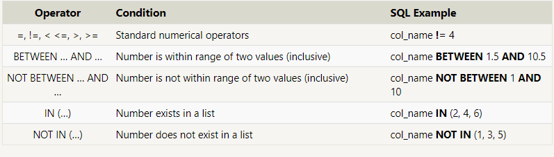
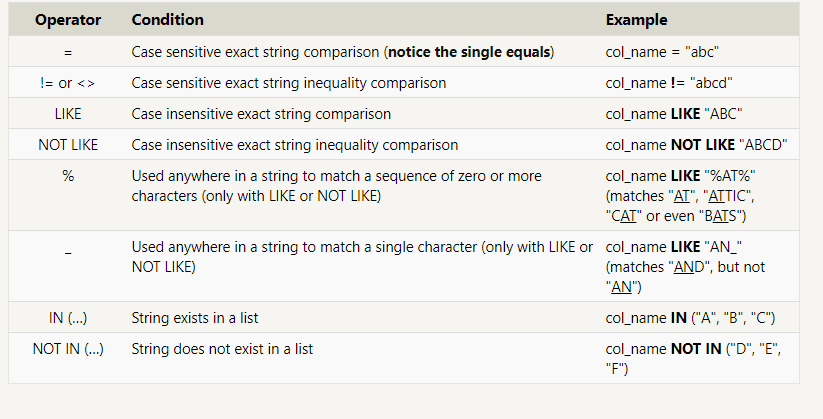

# SQL

**Reading**

1. [Complete SQLBolt (Intro, Lessons 1-4, 13-18)](https://sqlbolt.com/)
1. Practice SQL on [W3 Schools](https://www.w3schools.com/sql/trysql.asp?filename=trysql_select_all) - This resource has sample databases you can use to practice writing SQL queries.

**Additional Resources**

1. [A Primer on SQL](https://openlibra.com/en/book/a-primer-on-sql-3rd-edition) - Click the blue Download button
1. [SQL Cheat Sheet](http://www.cheat-sheets.org/sites/sql.su/)
1. SQL Playground

### What is SQL?

- **Structured Query Language**
- is a **language** designed to allow both technical and non-technical users **query**, **manipulate**, and **transform data** from a relational database.
- due to its _simplicity_, SQL databases provide _safe_ and _scalable storage_ for millions of websites and mobile applications.

`There are many popular SQL databases including

1. SQLite
2. MySQL
3. Postgres
4. Oracle
5. Microsoft SQL Server.
   All of them support the common SQL language standard, but each implementation can differ in the additional features and storage types it supports.
   `

**getting the information from DataBase could take miliseconds but from the cloud it will take second**
**we can save the info from the cloud at the DB(DataBase) to use it quieckly**

### SQL Lesson 1: SELECT queries 101

- To **retrieve data** from a SQL database, we need to write **SELECT** statements
  - **select statement** refere to **queries**
  - **A query** just a **statement** which declares
    - what data we are looking for
    - where to find it in the database
    - how to transform it before it is returned.
    - query has a specific syntax.

`SELECT * FROM mytable;`
//This query, in particular, is really useful because it's a simple way to inspect a table by dumping all the data at once.

````SELECT * FROM movies;
 SELECT title FROM movies;
SELECT director FROM movies;
SELECT title, director FROM movies;
SELECT title, year FROM movies;```
````

### SQL Lesson 2: Queries with constraints(restrictions) (Pt. 1)

- use a **WHERE** clause in the query
  - The clause is applied to **each row** of data by **checking specific column** **values** to determine whether it should be included in the results or not.
- complex clauses can be constructed by joining numerous
  - **AND**
  - **OR** logical keywords
    
- **writing clauses to constrain the set of rows returned**
  - **making the results more manageable to understand**
  - allows the _query_ to _run faster_ due to the reduction in unnecessary data being returned.

```SELECT title, year FROM movies
WHERE year BETWEEN 2000 AND 2010;

SELECT title, year FROM movies
WHERE year < 2000 OR year > 2010;
```

### SQL Lesson 3: Queries with constraints (Pt. 2)

When writing WHERE clauses with columns containing text data,
**SQL** supports **operators** to do:

1. case-insensitive string comparison
1. wildcard pattern matching.

We show a few common 

**full-text search** is best left to dedicated **libraries** like [Apache Lucene](https://lucene.apache.org/) or [Sphinx](http://sphinxsearch.com/). which designed specifically to do full text search.

```SELECT title, director FROM movies
WHERE title LIKE "Toy Story%";

SELECT  title director FROM movies
WHERE director LIKE "John Lasseter";

SELECT  title director FROM movies
WHERE director NOT LIKE "John Lasseter";

SELECT  title director FROM movies
WHERE title  LIKE "WALL%";
```

### SQL Lesson 4: Filtering and sorting Query results

- to discard rows that have a **duplicate column value** by using the **DISTINCT** keyword.
- way to **sort** results by a given column in ascending or descending order using the **ORDER BY** clause.

  - **LIMIT** will reduce the number of rows to return
  - **OFFSET** will specify where to begin counting the number rows from.

   <!-- terminal commands (psql-f schema.sql -d demo) -->

**SQL**
its a language not database, **database** contain recodrds of data stored in some place, and use english language sentences to _talk_ and acess the _database_
**Query language**

- query is question (request the data or info)
- database query:
  - select query : retiev data
  - action query : additional operations (insertion, updating and deleting)

**postgress**
_on the terminal_

1. **win -> sudo service postgresql start**
1. **pgstart**

**POSTGRES**
is a server running on machine and holds database
it has address can be connect to
to connect to postgress:
**go to terminal and**

1. already done with (pgstart) point
1. **psql**
1. **CREATE DATABASE demo;** (demo the name of the database)
1. **\l** list of the databse
1. connect to the created database **\c demo**
1. **\d** tables in database
1. **CREATE TABLE people (** table name is people
1. start to build it **person_id int,**
1. **first_name varchar(255),** max char 255
1. **last_name varchar(255)** max char 255
1. **);**
1. **INSERT INTO people VALUES ('1', 'Bebo', '3asal');**

### Schema collection of database objects with one database_username
