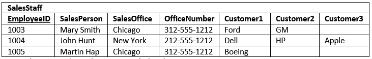
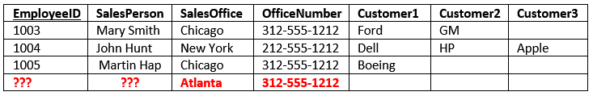

# Read: 14a - DB Normalization

**Reading**

1. Essential: [Database Normalization Explained in Simple English](https://www.essentialsql.com/get-ready-to-learn-sql-database-normalization-explained-in-simple-english/)

# Read: 14b - Project Ideas & APIs

[public-apis](https://github.com/public-apis/public-apis)

### Introduction to Database Normalization

1. a _process_ used to _organize a database_ into **tables** and **columns**.
1. a **table** should be about a **specific topic** and **only supporting topics included**.
1. By **limiting a table** to **one purpose**
   - you **reduce** the number of **duplicate data** contained within your database. This eliminates some issues stemming from database modifications.

**established rules**
_There are three normal forms most databases adhere to using_
[definition of a database table](https://www.essentialsql.com/what-is-a-database-table)

**Reasons for Database Normalization**
_three main reasons_

1. **minimize duplicate data**
1. **minimize or avoid data modification issues**
1. **simplify queries.**

Note: The primary key columns are underlined

<!-- heroku :
data base 
heruko will give the data base to work on it(server like github + database )
canvas
github (dont give U data base bs front end w backend)
 -->