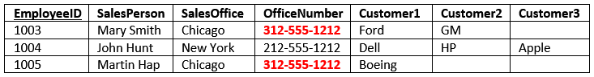
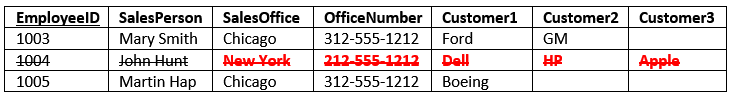

# Read: 14a - DB Normalization :joystick:

**Reading** :musical_keyboard:

1. Essential: [Database Normalization Explained in Simple English](https://www.essentialsql.com/get-ready-to-learn-sql-database-normalization-explained-in-simple-english/)

# Read: 14b - Project Ideas & APIs :joystick:

[public-apis](https://github.com/public-apis/public-apis)

### Introduction to Database Normalization :drum:

1. a _process_ used to _organize a database_ into **tables** and **columns**.
1. a **table** should be about a **specific topic** and **only supporting topics included**.
1. By **limiting a table** to **one purpose**
   - you **reduce** the number of **duplicate data** contained within your database. This eliminates some issues stemming from database modifications.

**established rules**
_There are three normal forms most databases adhere to using_
[definition of a database table](https://www.essentialsql.com/what-is-a-database-table)

**Reasons for Database Normalization**
_three main reasons_

1. **minimize duplicate data** :musical_note:
1. **minimize or avoid data modification issues** :postal_horn:
1. **simplify queries.** :musical_score:

**Note**: The primary key columns are underlined
The first thing to notice is this table serves many purposes including:

- **Identifying** the organization’s salespeople
- **Listing** the sales offices and phone numbers
- **Associating** a salesperson with an sales office
- **Showing** each salesperson’s customers
  `As a DBA this raises a red flag. In general I like to see tables that have one purpose. Having the table serve many purposes introduces many of the challenges; namely, data duplication, data update issues, and increased effort to query data.`

#### Data Duplication and Modification Anomalies

1. **Insert Anomaly**
   

1. **Update Anomaly**
   
   `If we don’t update all rows, then inconsistencies appear.`

1. **Deletion Anomaly**
   

### Definition of Database Normalization :writing_hand:

There are **three** common forms of **database** **normalization**:

1.  **1st** 1NF normal form: The information is stored in a **relational** table with each **column** containing atomic values. There are **no** repeating groups of **columns**.
1.  **2nd** 2NF normal form: The table is in **first normal** form and all the **columns depend on the table’s primary key**.
1.  **3rd** 3NF normal form: the table is in **second normal form** and all of its **columns are not transitively dependent on the primary key**.

**heroku :**

1.  data base
1.  heruko will give the data base to work on it(server like github + database )
1.  canvas
1.  github (dont give U data base bs front end w backend)
