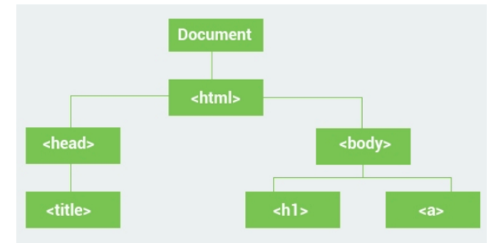
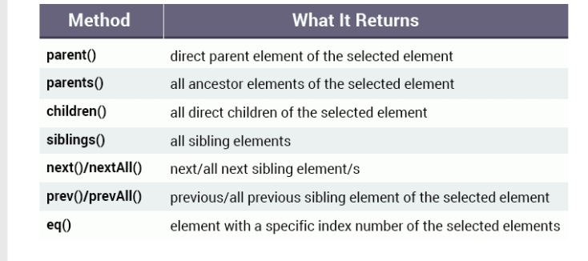
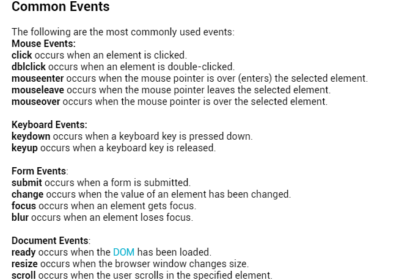

# SOLO LEARN

[jQuery](https://www.sololearn.com/Play/jQuery)

## jQuery

**What is jQuery**

1. is a fast, small, and feature-rich JavaScript library.
2. It makes things like HTML document traversal and manipulation, event handling, and animation much simpler.

**dom manipulatuon js**

```val element = document.getElementById("start");
element.innerHTML="Go";
```

**dom manipulation jQuery**
`$("#start").html("Go");`

1. download a copy of the jQuery library from `www.jquery.com`
1. include it from a `CDN` (Content Delivery Network)
   `<script src="https://code.jquery.com/jquery-3.1.1.js"></script>`
1. a good practice to wait for the **HTML document to be fully loaded and ready** before working with it.
   For that we use the **ready event** of the document object:

```$(document).ready(function (){
//jQuery code....
})
```

1. The **\$** is used to **access jQuery.**

   - This prevents any jQuery code from running before the document is finished loading.
     there is a handy shortcut for writing it:

   ```$(function (){
   //code here...
   })
   ```

   **START TO WORK**

- the CDN of the jQuery in the head
- defines the document ready event
- start the manibulation ...
  _example_
  if I want to change the div content from _start_ to _Go_ where the div has _id_ of start
  **jQuery**:
  ```$(function (){
  $("#start").html("Go");
  })
  ```
  `query=computing, databases A set of instructions passed to a database.`

**Syntax**
`$("selector").action()`

- The **\$** accesses jQuery.
- The **(selector)** finds HTML elements.
- The **action()** is then performed on the element(s).

**SELECTORS**


### Get & Set Attribute Values

**.attr() method**
**.removeAttr() method**

#### Get Content and Set Content

**.html() method**
**.text() method**

## Summary

The following jQuery methods are available to get and set content and attributes of selected HTML elements:

1. text() sets or returns the text content of selected elements.
1. html() sets or returns the content of selected elements (including HTML markup).
1. val() sets or returns the value of form fields.
1. attr() sets or returns the value of attributes.
1. removeAttr() removes the specified attribute.

#### Adding Content

the **html()** and **text()** methods can be used to **get and set** the content of a selected element.but the **existing content is lost**.
jQuery methods that **add new content to a selected element without deleting the existing content**:

1. **append()** inserts content at the **end** of the selected elements.
1. **prepend()**inserts content at the **beginning** of the selected elements.
1. **after()**inserts content **after** the selected elements.
   - we can use the html() markup for the after() method
   - also they can be used to add newly created element
1. **before()** inserts content **before** the selected elements.

**Adding New Elements**

1. append()
1. prepend()
1. before()
1. after()

#### Manipulating CSS

1. **.addClass()** method adding one or more class to the element
2. **.removeClass()** method
3. **.toggleClass()**method toggles between adding/removing classes from the selected elements,
   - meaning that if the specified class exists for the element, it is removed, and if it does not exist, it is added.

**css properties**
Similar to the html() method, the css() method can be used to get and set CSS property values.

**Multiple Properties**
to set multiple CSS properties the css methods use **JSON syntax**:
`css({'property':'value', 'property':'value'.....etc})`
`$('p').css({'background-color':'blue', 'font-size':'20px', 'color':'white'});`

**Dimentions**
The **width() and height**(_numbers only no px_) methods can be used to get and set the width and height of HTML elements.

1. The width() and height() methods **get** and **set** the dimensions **without** the padding, borders and margins.
1. The **innerWidth() and innerHeight()** methods also include the **padding**.
1. The **outerWidth()** and **outerHeight()** methods include the **padding and borders**.
   `padding margin border(outer padding 2 sides + border)(inner padding 2 sides)`

## manipulate DOM

When you open any webpage in a browser, the **HTML** of the page is **loaded** and **rendered** visually on the screen.
To accomplish this, the browser **builds the Document Object Model (DOM)** of that page, _which is an object oriented model_ of its logical structure.
The DOM of an HTML document can be represented as a nested set of boxes:



1. The <html> element is the **parent** of <body> and an **ancestor** of everything below it.
1. The <body> element is the **parent** of the <h1> and <a> elements.
1. The <h1> and <a> elements are **child** elements of the <body> element and **descendants** of <html>.
1. The <h1> and <a> elements are **siblings** (they share the same parent).

### Summary

- An **ancestor** is a _parent_, _grandparent_, _great-grandparent_, and so on.
- A **descendant** is a _child_, _grandchild_, _great-grandchild_, and so on.
- **Siblings** share the **same parent**.

### DOM Traversal (crossing)

**.parent() method**

1. can only traverse a single level up the DOM tree.
   **.parents()** method To get all ancestors of the selected element
   

   - The **eq()** method can be used to select a **specific element** from multiple selected elements.**first=0 second=1 ... etc**

### Remove Elements

**.remove()** method
`$("p").eq(1).remove();`
_Removing Content_
The **empty()** method is used to remove the _child_ elements of the selected element(s).

### Events

Handling Events(event handler is a function)
JQuery provides an efficient way to handle events.
Events occur when the user performs an action, such as

1. **clicking an element**
1. **moving the mouse**
1. **submitting a form**.

_using pure js_

```window.onload=function(){
var a =document.getElementById('demo');
a.onclick=function(){
document.body.innerHTML=Date();
   }
   };
```

// the same event handling using jQuery

```$(function(){
$("#demo").click(function(){
$('body').html(Date());
});
});
```

_Handling Events_
Another way to handle events in jQuery is by using the **on()** method.
You can remove event handlers using the **off()** method.


**The Event Object**
Every **event handling function** can **receive an event object.** which contains **properties and methods** related to the event:

1. **pageX, pageY the mouse position** (X & Y coordinates) at the time the event occurred, relative to the top left of the page.
1. **type** the type of the event (e.g. "click").
1. **which** the button or key that was pressed.
1. **data** any data that was passed in when the event was bound.
1. **target** the DOM element that initiated the event.
1. **preventDefault()** prevent the default action of the event (e.g., following a link).
1. **stopPropagation()** Stop the event from bubbling up to other elements.

### Trigger Events

**trigger() method.**

**TO DO LIST**

```
<!-- html -->
<!DOCTYPE html>
<html>
    <head>
        <title>Page Title</title>
        <script src="https://code.jquery.com/jquery-3.1.1.js"></script>
    </head>
    <body>
        <div>Click me</div>
        <h1>My To-Do List</h1>
        <input type="text" placeholder="New item" />
        <button id="add">Add</button>
        <ol id="mylist"></ol>
    </body>
</html>

<!-- the jQurey will be: -->
$(function(){
    //function on click
    $('#add').on('click', function(){
        //creat list and put the value of the input appended to the OL
    var element= $("<li></li>").text('input');
    // putting the values of the inputs after each li cretaed
    $('#mylist').append(element);
    });
});

another thing can be done:
removing the element from the list :
$(function (){
    // function on click
   $('#add').on('click', function(){
    //   storing the value of the input in var
      var value=$('input').val();
      if (value !==''){
        //   if statment to deal with the empty input
        // creat li element on each click
          var element=$('<li></li>').text(value);
        //   adding button with class styleing it to remove
          $(element).append("<button class='remove'>X</button>");
        //   putting the values from the input in the list
        $('#mylist').append(element);
        // another function to remove the item on click
        $('.remove').on('click', function(){
            $(this).parent().remove();
        })
      }
   }) ;
});
```

### jQuery effects

**animation**

1. The **hide() and show()** methods are used to hide and show the selected elements.
2. The toggle() method is used to **toggle between hiding and showing elements**.

   - time inside the toggle(1000) in **millesecond**

3. fadeIn/fadeOut
   Similar to the hide/show methods, jQuery provides the fadeIn/fadeOut methods, which fade an element in and out of visibility.
   Just like the toggle() method switches between hiding and showing, the **fadeToggle()** method fades in and out.

4. slideup/slidedown
   The slideUp() and slideDown() methods are used to create a sliding effect on elements.

**Animate**
_.animate()_

1. animate to a set value
1. or to a value relative to the current value.
   You need to define the CSS properties to be animated as its parameter in **JSON** format ("key":"value" pairs).
   The second parameter defines the speed of the animation.

```$("div").click(function() {
  $("div").animate({width: '250px'}, 1000);
});
```

1. Multiple properties can be animated at the same time by separating them with **commas**.

```$(function() {
    $("div").click(function() {
        $("div").animate({
            width: '+=250px',
            height: '+=250px'
        }, 1000);
    });
});
```

**on each click will increase the values**
**paddingLeft no -dashes**

```$("div").animate({
width: '250px',
height: '250px'
}, 1000);
works only one time on he first click.
```

### Animation Queue

- jQuery comes with **queue** functionality for animations.
  - if you write **multiple animate() calls one after another**
    - jQuery creates an **"internal" queue** for these method calls.
    - Then it runs the **animate calls one-by-one.**

**_Drop-Down Menu_**

```$(function() {
    $("#item").click(function() {
\$("#submenu").slideToggle(500);
});
});
```
